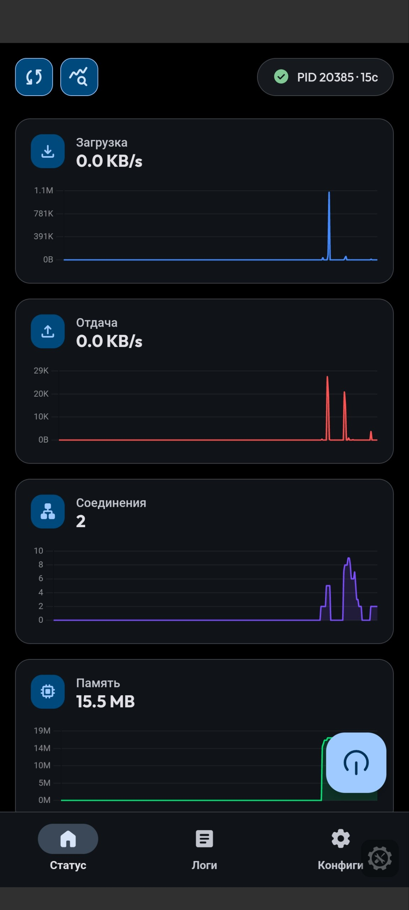
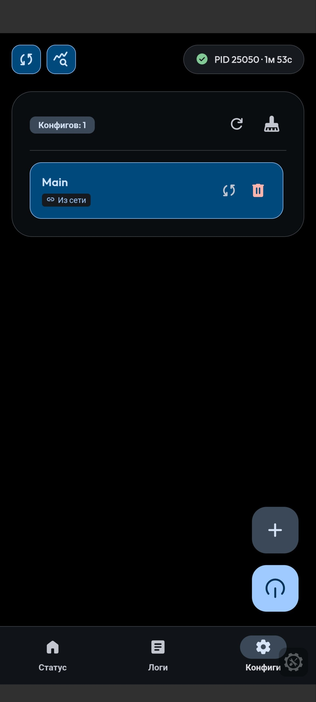
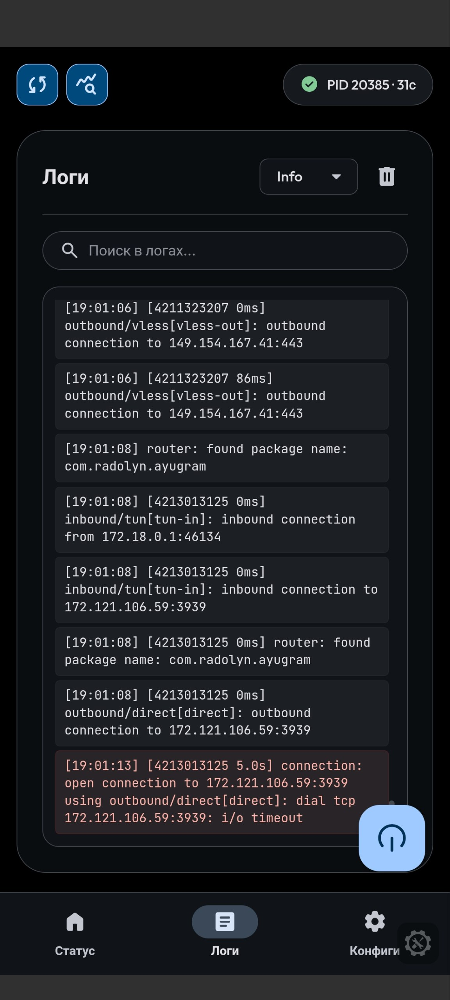

# 🌌 Sing-box KSU

**The ultimate Sing-box core integration for KernelSU with a modern, feature-rich WebUI.**

---

## ✨ Overview

**Sing-box KSU** is a powerful network proxy module designed specifically for **KernelSU**. It combines the high-performance [Sing-box](https://sing-box.sagernet.org/) core with a stunning, modern Web Interface (WebUI) that allows you to manage your configurations, monitor traffic, and view logs directly from your device.

## 🚀 Key Features

- 📱 **Modern WebUI**: A beautiful Material Design 3 inspired interface for easy management.
- 📊 **Real-time Monitoring**: Visual traffic charts and connection statistics powered by Chart.js.
- ⚙️ **Config Management**: Add, remove, and manage multiple Sing-box configurations with ease.
- 🔄 **Auto-Update**: Built-in support for remote configuration updates with customizable intervals.
- 📜 **Log Viewer**: Integrated log viewer with history support for easy debugging.
- ⚡ **Kernel-Level Performance**: Optimized for KernelSU to provide the best performance and battery life.
- 🛠️ **Background Daemons**: Robust status monitoring and update daemons.

---

## 📸 Screenshots

| Home (Status) | Configs | Logs |
| :---: | :---: | :---: |
|  |  |  |

---

## 🛠️ Installation

1.  Open your **KernelSU** manager app.
2.  Navigate to the **Modules** tab.
3.  Click **Install** and select the `Sing-box KSU` zip file.
4.  Reboot your device to activate the module.

## 📖 How to Use

### Accessing the WebUI
Once installed, you can access the management interface through the KernelSU manager's module settings or by clicking the "Open" button in the module card.

### Managing daemons
Just tap the update/status buttons at the top of the main page. Blue - enabled, grey - disabled.

### Managing Configs
1.  Go to the **Configs** tab.
2.  Click the **+** button (FAB) to add a new configuration via URL.
3.  Enable **Auto-update** if you want your configs to stay synced with a remote source.

---

## 📂 File Structure

The module uses the following directory for all data:
- `/data/adb/sing-box/`: Main working directory.
  - `Main.json`: Current active configuration.
  - `configs/`: Stored configuration files.
  - `run.log`: Live execution logs.

---

## 🛠️ Technical Details

- **Core**: Sing-box
- **Frontend**: HTML5, Vanilla JS, CSS3 (MD3 Design)
- **Backend**: Shell scripts (`stat_daemon.sh`, `autoupdater.sh`)
- **UI Language**: Russian (RU)
- **Compatibility**: KernelSU (Required)

---

## 🇷🇺 Описание на русском

**Sing-box KSU** — это модуль-оболочка над ядром `sing-box`, разработанный специально для **KernelSU**.

**Основные возможности:**
- 📱 **Удобный WebUI**: Красивый интерфейс в стиле Material Design 3.
- 📊 **Статистика в реальном времени**: Графики трафика и статистика соединений.
- ⚙️ **Управление конфигурациями**: Добавление и выбор конфигов через URL.
- 🔄 **Автообновление**: Поддержка автоматического обновления удаленных конфигураций.
- 📜 **Просмотр логов**: Удобный лог-вьювер с историей.

---

## 🤝 Credits & Acknowledgements

- [Sing-box](https://github.com/SagerNet/sing-box) for the incredible core.
- [KernelSU](https://github.com/tiann/KernelSU) for the best root solution.
- [Chart.js](https://www.chartjs.org/) for the beautiful visualizations.

---

  Developed with ❤️ by <b>soranerai</b>

